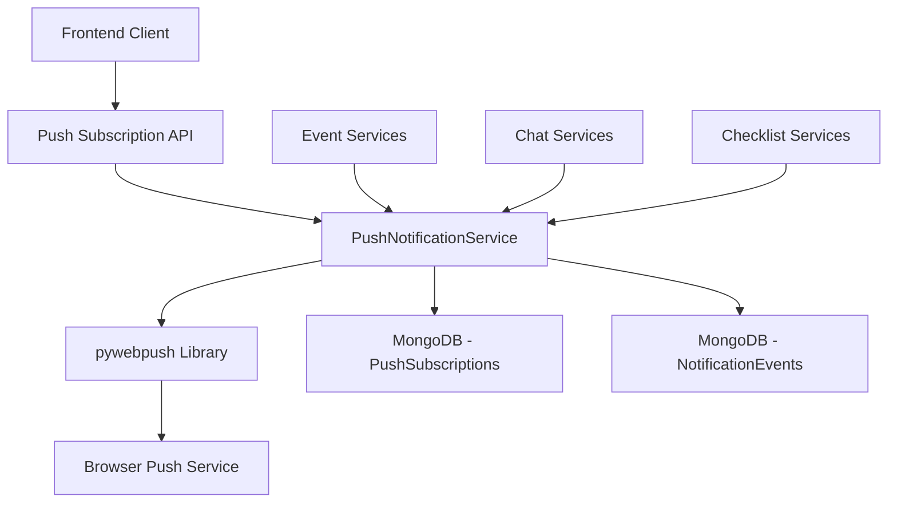

# Web Push Notifications Implementation for Loom PWA

This document provides the complete implementation plan for adding web push notifications to the Loom PWA application, with notifications sent to partners whenever there are new events, chats, or checklists from a partner.

## Project Overview

Implement web push notifications to notify partners whenever there are new events, chats, or checklists from a partner. The notification should include a link to the app.

## Technical Architecture

### Backend Components



### Data Models

#### PushSubscription
- `user_id`: Reference to user
- `endpoint`: Browser push endpoint URL
- `keys`: Encryption keys (`p256dh`, `auth`)
- `ua`: User agent string
- `platform`: Device platform
- `topics`: Array of subscribed topics
- `active`: Subscription status
- `created_at`: Timestamp
- `updated_at`: Timestamp

#### NotificationEvent
- `user_id`: Reference to user
- `type`: Notification type (`proposals`, `chat`, `checklists`, etc.)
- `subtype`: Specific event subtype
- `entity_ref`: References to related entities
- `payload_summary`: Summary for debugging
- `dedupe_key`: For preventing duplicate notifications
- `delivery_status`: Status for each subscription
- `created_at`: Timestamp

### API Endpoints

1. `POST /push/subscribe` - Create/update subscription
2. `DELETE /push/subscribe` - Deactivate subscription
3. `PUT /push/subscribe/topics` - Update notification topics
4. `POST /push/test` - Send test notification (dev only)

### Notification Topics

- `proposals`: New proposals and updates
- `chat`: Chat messages
- `checklists`: Checklist items
- `invites`: Event invitations
- `reminders`: Event reminders
- `system`: System announcements

## Implementation Steps

### 1. Backend Implementation

#### 1.1 Add Dependencies

Update `backend/requirements.txt` to include:
```
pywebpush>=1.12.0
```

#### 1.2 Update Data Models

Add the following models to `backend/app/models.py`:

```python
# Push Subscription Models
class PushSubscriptionBase(BaseModel):
    user_id: PyObjectId
    endpoint: str
    keys: dict  # Contains 'p256dh' and 'auth' keys
    ua: Optional[str] = None  # User agent
    platform: Optional[Literal["web", "ios_pwa", "android_pwa", "desktop"]] = "web"
    topics: List[str] = []  # User's notification preferences

class PushSubscriptionCreate(PushSubscriptionBase):
    pass

class PushSubscriptionUpdate(BaseModel):
    topics: Optional[List[str]] = None
    active: Optional[bool] = None

class PushSubscription(MongoBaseModel, PushSubscriptionBase):
    created_at: datetime = Field(default_factory=datetime.utcnow)
    updated_at: datetime = Field(default_factory=datetime.utcnow)
    active: bool = True

    @field_serializer('user_id')
    def serialize_user_id(self, value):
        return str(value)

# Notification Event Models
class NotificationEventBase(BaseModel):
    user_id: PyObjectId
    type: str  # e.g., 'proposals', 'chat', 'checklists', 'invites', 'reminders', 'system'
    subtype: Optional[str] = None  # e.g., 'awaiting_approval', 'mention', etc.
    entity_ref: dict  # References to related entities
    payload_summary: str  # Short string for debugging/analytics
    dedupe_key: str  # type:entity:user:bucket for deduplication

class NotificationEventCreate(NotificationEventBase):
    pass

class NotificationEvent(MongoBaseModel, NotificationEventBase):
    created_at: datetime = Field(default_factory=datetime.utcnow)
    delivery_status: List[dict] = []  # Status for each subscription

    @field_serializer('user_id')
    def serialize_user_id(self, value):
        return str(value)
```

#### 1.3 Create Push Notification Router

Create `backend/app/routers/push.py`:

```python
from fastapi import APIRouter, Depends, HTTPException
from typing import List
import logging
from .. import models
from ..auth import get_current_user
from ..database import get_database
from ..config import settings
from pydantic import BaseModel

router = APIRouter()
logger = logging.getLogger(__name__)

class PushSubscriptionCreate(BaseModel):
    endpoint: str
    keys: dict
    ua: str = None
    platform: str = "web"
    topics: List[str] = []

class PushSubscriptionUpdate(BaseModel):
    topics: List[str]

class PushTestRequest(BaseModel):
    message: str = "Test notification"

@router.post("/push/subscribe")
async def create_push_subscription(
    subscription_data: PushSubscriptionCreate,
    user: models.User = Depends(get_current_user),
    db = Depends(get_database)
):
    """Create or update a push subscription for the current user"""
    try:
        # Check if subscription already exists
        existing_subscription = await db.push_subscriptions.find_one({
            "user_id": user.id,
            "endpoint": subscription_data.endpoint
        })
        
        subscription_dict = subscription_data.dict()
        subscription_dict["user_id"] = user.id
        
        if existing_subscription:
            # Update existing subscription
            result = await db.push_subscriptions.update_one(
                {"_id": existing_subscription["_id"]},
                {"$set": {**subscription_dict, "updated_at": datetime.utcnow(), "active": True}}
            )
            subscription = await db.push_subscriptions.find_one({"_id": existing_subscription["_id"]})
        else:
            # Create new subscription
            subscription_model = models.PushSubscription(**subscription_dict)
            result = await db.push_subscriptions.insert_one(subscription_model.model_dump())
            subscription = await db.push_subscriptions.find_one({"_id": result.inserted_id})
        
        return {"data": subscription}
    except Exception as e:
        logger.error(f"Error creating push subscription: {e}")
        raise HTTPException(status_code=500, detail="Failed to create push subscription")

@router.delete("/push/subscribe")
async def delete_push_subscription(
    endpoint_data: dict,
    user: models.User = Depends(get_current_user),
    db = Depends(get_database)
):
    """Deactivate a push subscription for the current user"""
    try:
        result = await db.push_subscriptions.update_one(
            {"user_id": user.id, "endpoint": endpoint_data["endpoint"]},
            {"$set": {"active": False, "updated_at": datetime.utcnow()}}
        )
        
        if result.modified_count == 0:
            raise HTTPException(status_code=404, detail="Subscription not found")
        
        return {"data": None, "message": "Subscription deactivated successfully"}
    except Exception as e:
        logger.error(f"Error deleting push subscription: {e}")
        raise HTTPException(status_code=500, detail="Failed to delete push subscription")

@router.put("/push/subscribe/topics")
async def update_push_subscription_topics(
    topics_data: PushSubscriptionUpdate,
    user: models.User = Depends(get_current_user),
    db = Depends(get_database)
):
    """Update notification topics for the user's push subscription"""
    try:
        result = await db.push_subscriptions.update_one(
            {"user_id": user.id, "active": True},
            {"$set": {"topics": topics_data.topics, "updated_at": datetime.utcnow()}}
        )
        
        if result.modified_count == 0:
            raise HTTPException(status_code=404, detail="Active subscription not found")
        
        subscription = await db.push_subscriptions.find_one({"user_id": user.id, "active": True})
        return {"data": subscription}
    except Exception as e:
        logger.error(f"Error updating push subscription topics: {e}")
        raise HTTPException(status_code=500, detail="Failed to update push subscription topics")

@router.post("/push/test")
async def send_test_notification(
    test_data: PushTestRequest,
    user: models.User = Depends(get_current_user),
    db = Depends(get_database)
):
    """Send a test notification to the current user (development only)"""
    # Only allow in development environments
    if settings.ENV != "dev" and settings.ENV != "development":
        raise HTTPException(status_code=403, detail="Test notifications only available in development")
    
    # Implementation would go here
    return {"data": None, "message": "Test notification sent successfully"}
```

#### 1.4 Update Main Router

Add the push router to `backend/app/main.py`:

```python
# Add to imports
from .routers import push

# Add to router includes
app.include_router(push.router, prefix=settings.API_V1_STR)
```

#### 1.5 Implement Push Notification Service

Update `backend/app/services.py`:

```python
from pywebpush import webpush, WebPushException
import json
import logging

logger = logging.getLogger(__name__)

class PushNotificationService:
    def __init__(self, vapid_subject: str, vapid_public_key: str, vapid_private_key: str):
        self.vapid_subject = vapid_subject
        self.vapid_public_key = vapid_public_key
        self.vapid_private_key = vapid_private_key
    
    async def send_notification(self, subscription: dict, payload: dict) -> bool:
        """
        Send a push notification to a specific subscription
        Returns True if successful, False otherwise
        """
        try:
            webpush(
                subscription_info={
                    "endpoint": subscription["endpoint"],
                    "keys": subscription["keys"]
                },
                data=json.dumps(payload),
                vapid_private_key=self.vapid_private_key,
                vapid_claims={
                    "sub": self.vapid_subject
                }
            )
            return True
        except WebPushException as e:
            # Handle specific exceptions like expired subscriptions
            if e.response and e.response.status_code == 410:
                # Subscription expired, mark as inactive
                logger.info(f"Subscription expired: {subscription.get('endpoint')}")
            else:
                logger.error(f"Failed to send push notification: {e}")
            return False
    
    async def send_notifications_to_user(self, db, user_id: str, payload: dict, topic: str = None) -> int:
        """
        Send notifications to all active subscriptions for a user
        Returns the number of successful sends
        """
        try:
            # Get user's active subscriptions
            query = {"user_id": user_id, "active": True}
            if topic:
                query["topics"] = {"$in": [topic]}
            
            subscriptions = await db.push_subscriptions.find(query).to_list(None)
            
            if not subscriptions:
                logger.info(f"No active subscriptions found for user {user_id}")
                return 0
            
            successful_sends = 0
            for subscription in subscriptions:
                if await self.send_notification(subscription, payload):
                    successful_sends += 1
            
            return successful_sends
        except Exception as e:
            logger.error(f"Error sending notifications to user {user_id}: {e}")
            return 0

# Initialize the service
push_notification_service = PushNotificationService(
    vapid_subject=getattr(settings, "VAPID_SUBJECT", "mailto:admin@loom.com"),
    vapid_public_key=getattr(settings, "VAPID_PUBLIC_KEY", ""),
    vapid_private_key=getattr(settings, "VAPID_PRIVATE_KEY", "")
)
```

#### 1.6 Update Configuration

Add VAPID settings to `backend/app/config.py`:

```python
# Add to Settings class
# VAPID settings for push notifications
VAPID_SUBJECT: str = "mailto:admin@loom.com"
VAPID_PUBLIC_KEY: str = ""
VAPID_PRIVATE_KEY: str = ""
```

### 2. Frontend Implementation

#### 2.1 Push Notification Context (UI State Management)

Create `src/contexts/PushNotificationContext.tsx` for UI state management:

```typescript
import React, { createContext, useContext, useState, useEffect } from 'react';
import { useQuery, useMutation, useQueryClient } from '@tanstack/react-query';
import { apiClient } from '@/api/client';
import { useToast } from '@/components/ui/use-toast';
import { useTranslation } from '@/i18n';

interface PushSubscription {
  endpoint: string;
  keys: {
    p256dh: string;
    auth: string;
  };
  ua?: string;
  platform?: 'web' | 'ios_pwa' | 'android_pwa' | 'desktop';
  topics: string[];
  active: boolean;
}

interface PushNotificationContextType {
  permission: NotificationPermission;
  enabledTopics: string[];
  isLoading: boolean;
  requestPermission: () => Promise<void>;
  enableNotifications: () => Promise<void>;
  disableNotifications: () => Promise<void>;
  toggleTopic: (topicId: string, enabled: boolean) => Promise<void>;
}

const PushNotificationContext = createContext<PushNotificationContextType | undefined>(undefined);

export function PushNotificationProvider({ children }: { children: React.ReactNode }) {
  const { toast } = useToast();
  const { t } = useTranslation();
  const queryClient = useQueryClient();
  const [permission, setPermission] = useState<NotificationPermission>('default');
  
  // Get current subscription
  const { data: subscription, isLoading } = useQuery<PushSubscription>({
    queryKey: ['push-subscription'],
    queryFn: async () => {
      // This would be implemented based on your API
      const response = await apiClient.request('/push/subscription');
      return response.data;
    },
    enabled: permission === 'granted',
  });
  
  const enabledTopics = subscription?.topics || ['proposals', 'reminders'];

  // Check current notification permission status
  useEffect(() => {
    setPermission(Notification.permission);
  }, []);

  // Mutations
 const subscribeMutation = useMutation({
    mutationFn: async (topics: string[]) => {
      const registration = await navigator.serviceWorker.ready;
      const pushSubscription = await registration.pushManager.subscribe({
        userVisibleOnly: true,
        applicationServerKey: import.meta.env.VITE_VAPID_PUBLIC_KEY
      });

      const subscriptionData = {
        endpoint: pushSubscription.endpoint,
        keys: {
          p256dh: arrayBufferToBase64(pushSubscription.getKey('p256dh')),
          auth: arrayBufferToBase64(pushSubscription.getKey('auth'))
        },
        ua: navigator.userAgent,
        platform: 'web',
        topics
      };

      return apiClient.request('/push/subscribe', {
        method: 'POST',
        body: JSON.stringify(subscriptionData),
      });
    },
    onSuccess: () => {
      queryClient.invalidateQueries({ queryKey: ['push-subscription'] });
      toast({
        title: t('notificationsEnabled'),
        description: t('notificationsEnabledDesc')
      });
    },
    onError: (error) => {
      toast({
        title: t('error'),
        description: t('failedToEnableNotifications'),
        variant: 'destructive'
      });
    }
  });

  const unsubscribeMutation = useMutation({
    mutationFn: async () => {
      const registration = await navigator.serviceWorker.ready;
      const pushSubscription = await registration.pushManager.getSubscription();
      
      if (pushSubscription) {
        await apiClient.request('/push/subscribe', {
          method: 'DELETE',
          body: JSON.stringify({
            endpoint: pushSubscription.endpoint
          }),
        });
        
        await pushSubscription.unsubscribe();
      }
    },
    onSuccess: () => {
      queryClient.invalidateQueries({ queryKey: ['push-subscription'] });
      toast({
        title: t('notificationsDisabled'),
        description: t('notificationsDisabledDesc')
      });
    },
    onError: (error) => {
      toast({
        title: t('error'),
        description: t('failedToDisableNotifications'),
        variant: 'destructive'
      });
    }
  });

  const updateTopicsMutation = useMutation({
    mutationFn: async (topics: string[]) => {
      return apiClient.request('/push/subscribe/topics', {
        method: 'PUT',
        body: JSON.stringify({ topics }),
      });
    },
    onSuccess: () => {
      queryClient.invalidateQueries({ queryKey: ['push-subscription'] });
      toast({
        title: t('preferencesUpdated'),
        description: t('notificationPreferencesUpdated')
      });
    },
    onError: (error) => {
      toast({
        title: t('error'),
        description: t('failedToUpdatePreferences'),
        variant: 'destructive'
      });
    }
  });

  const requestPermission = async () => {
    if (!('serviceWorker' in navigator) || !('PushManager' in window)) {
      toast({
        title: t('notSupported'),
        description: t('pushNotificationsNotSupported'),
        variant: 'destructive'
      });
      return;
    }

    try {
      const permission = await Notification.requestPermission();
      setPermission(permission);
      
      if (permission !== 'granted') {
        toast({
          title: t('permissionDenied'),
          description: t('enableNotificationsInBrowser'),
          variant: 'destructive'
        });
      }
    } catch (error) {
      console.error('Error requesting notification permission:', error);
      toast({
        title: t('error'),
        description: t('failedToRequestPermission'),
        variant: 'destructive'
      });
    }
  };

 const enableNotifications = async () => {
    if (permission !== 'granted') {
      await requestPermission();
    }
    
    if (Notification.permission === 'granted') {
      subscribeMutation.mutate(enabledTopics);
    }
  };

  const disableNotifications = async () => {
    unsubscribeMutation.mutate();
  };

  const toggleTopic = async (topicId: string, enabled: boolean) => {
    let newTopics: string[];
    if (enabled) {
      newTopics = [...enabledTopics, topicId];
    } else {
      newTopics = enabledTopics.filter(id => id !== topicId);
    }
    
    updateTopicsMutation.mutate(newTopics);
  };

  const value = {
    permission,
    enabledTopics,
    isLoading,
    requestPermission,
    enableNotifications,
    disableNotifications,
    toggleTopic
  };

  return (
    <PushNotificationContext.Provider value={value}>
      {children}
    </PushNotificationContext.Provider>
  );
}

export function usePushNotifications() {
  const context = useContext(PushNotificationContext);
  if (context === undefined) {
    throw new Error('usePushNotifications must be used within a PushNotificationProvider');
  }
  return context;
}

function arrayBufferToBase64(buffer: ArrayBuffer | null): string {
  if (!buffer) return '';
  
  const bytes = new Uint8Array(buffer);
  let binary = '';
  for (let i = 0; i < bytes.byteLength; i++) {
    binary += String.fromCharCode(bytes[i]);
  }
  return btoa(binary);
}
```

#### 2.2 Notification Settings Component

Create `src/components/NotificationSettings.tsx` with Loom branding and i18n:

```typescript
import React from 'react';
import { usePushNotifications } from '@/contexts/PushNotificationContext';
import { useTranslation } from '@/i18n';
import { Switch } from '@/components/ui/switch';
import { Label } from '@/components/ui/label';
import { Card, CardContent, CardHeader, CardTitle } from '@/components/ui/card';
import { Button } from '@/components/ui/button';
import { Alert, AlertDescription } from '@/components/ui/alert';

const NOTIFICATION_TOPICS = [
  { id: 'proposals', labelKey: 'proposals', descriptionKey: 'proposalsDesc' },
  { id: 'chat', labelKey: 'chatMessages', descriptionKey: 'chatMessagesDesc' },
  { id: 'checklists', labelKey: 'checklists', descriptionKey: 'checklistsDesc' },
  { id: 'invites', labelKey: 'eventInvites', descriptionKey: 'eventInvitesDesc' },
  { id: 'reminders', labelKey: 'reminders', descriptionKey: 'remindersDesc' },
 { id: 'system', labelKey: 'systemUpdates', descriptionKey: 'systemUpdatesDesc' }
];

export function NotificationSettings() {
  const { 
    permission, 
    enabledTopics, 
    isLoading,
    enableNotifications,
    disableNotifications,
    toggleTopic
  } = usePushNotifications();
  const { t } = useTranslation();

  const handleEnableNotifications = async () => {
    await enableNotifications();
  };

  const handleDisableNotifications = async () => {
    await disableNotifications();
  };

  const handleTopicToggle = async (topicId: string, enabled: boolean) => {
    await toggleTopic(topicId, enabled);
  };

  return (
    <Card className="border-[hsl(var(--loom-border))] bg-[hsl(var(--loom-surface))]">
      <CardHeader>
        <CardTitle className="text-[hsl(var(--loom-text))]">{t('pushNotifications')}</CardTitle>
      </CardHeader>
      <CardContent className="space-y-6">
        <div className="flex items-center justify-between">
          <div>
            <h3 className="font-medium text-[hsl(var(--loom-text))]">{t('enablePushNotifications')}</h3>
            <p className="text-sm text-[hsl(var(--loom-text-muted))]">
              {t('receiveTimelyNotifications')}
            </p>
          </div>
          {permission === 'granted' ? (
            <Button
              onClick={handleDisableNotifications}
              variant="destructive"
              disabled={isLoading}
            >
              {isLoading ? t('disabling') : t('disable')}
            </Button>
          ) : (
            <Button
              onClick={handleEnableNotifications}
              disabled={permission === 'denied' || isLoading}
              className="bg-[hsl(var(--loom-primary))] hover:bg-[hsl(var(--loom-primary)/0.9)]"
            >
              {isLoading ? t('enabling') : (permission === 'denied' ? t('blocked') : t('enable'))}
            </Button>
          )}
        </div>

        {permission === 'granted' && (
          <div className="space-y-4">
            <h4 className="font-medium text-[hsl(var(--loom-text))]">{t('notificationTypes')}</h4>
            {NOTIFICATION_TOPICS.map((topic) => (
              <div key={topic.id} className="flex items-center justify-between py-2">
                <div>
                  <Label className="font-medium text-[hsl(var(--loom-text))]">
                    {t(topic.labelKey)}
                  </Label>
                  <p className="text-sm text-[hsl(var(--loom-text-muted))]">
                    {t(topic.descriptionKey)}
                  </p>
                </div>
                <Switch
                  checked={enabledTopics.includes(topic.id)}
                  onCheckedChange={(checked) => handleTopicToggle(topic.id, checked)}
                  className="[--loom-switch-bg:hsl(var(--loom-primary))]"
                />
              </div>
            ))}
          </div>
        )}

        {permission === 'denied' && (
          <Alert variant="destructive" className="border-[hsl(var(--loom-destructive-border))]">
            <AlertDescription className="text-[hsl(var(--loom-destructive-text))]">
              {t('notificationsBlocked')}
            </AlertDescription>
          </Alert>
        )}
      </CardContent>
    </Card>
  );
}
```

#### 2.3 Update Main Application

Update the main application to include the provider:

```typescript
// In src/main.tsx or src/App.tsx
import { PushNotificationProvider } from '@/contexts/PushNotificationContext';

// Wrap your app with the provider
root.render(
  <React.StrictMode>
    <PushNotificationProvider>
      <App />
    </PushNotificationProvider>
  </React.StrictMode>
);
```

#### 2.4 Update Service Worker

Update `public/sw.js` with push event handling and Loom branded icons:

```javascript
// Add to existing service worker
self.addEventListener('push', (event) => {
  if (event.data) {
    const data = event.data.json();
    
    const options = {
      body: data.body || '',
      icon: '/icons/loom-logo-192.png', // Use Loom branded icon
      badge: '/icons/loom-logo-96.png', // Use Loom branded badge
      tag: 'loom-notification',
      data: data.data || {},
      actions: [
        {
          action: 'view',
          title: 'View'
        },
        {
          action: 'dismiss',
          title: 'Dismiss'
        }
      ]
    };

    event.waitUntil(
      self.registration.showNotification(data.title || 'Loom Notification', options)
    );
  }
});

self.addEventListener('notificationclick', (event) => {
  event.notification.close();

  if (event.action === 'view') {
    // Handle deep linking based on notification data
    const data = event.notification.data;
    let url = '/';
    
    if (data?.type === 'event_created' && data?.event_id) {
      url = `/event/${data.event_id}`;
    } else if (data?.type === 'chat_message' && data?.event_id) {
      url = `/event/${data.event_id}`;
    } else if (data?.type === 'proposal_created' && data?.proposal_id) {
      url = `/proposal/${data.proposal_id}`;
    } else if (data?.type === 'checklist_item' && data?.event_id) {
      url = `/event/${data.event_id}`;
    }
    
    event.waitUntil(
      clients.openWindow(url)
    );
  }
});
```

#### 2.5 i18n Translations

Add the necessary translations to your i18n files:

```json
// In your translation files (en.json, zh.json, etc.)
{
  "pushNotifications": "Push Notifications",
  "enablePushNotifications": "Enable Push Notifications",
  "receiveTimelyNotifications": "Receive timely notifications about events, chats, and checklists",
  "notificationTypes": "Notification Types",
  "proposals": "Proposals",
  "proposalsDesc": "Notifications about new proposals and proposal updates",
  "chatMessages": "Chat Messages",
  "chatMessagesDesc": "Notifications when you receive new chat messages",
  "checklists": "Checklists",
  "checklistsDesc": "Notifications about checklist items assigned to you",
  "eventInvites": "Event Invites",
  "eventInvitesDesc": "Notifications about event invitations",
  "reminders": "Reminders",
  "remindersDesc": "Notifications about upcoming events",
  "systemUpdates": "System Updates",
  "systemUpdatesDesc": "Important system notifications and updates",
  "enable": "Enable",
  "disable": "Disable",
  "enabling": "Enabling...",
  "disabling": "Disabling...",
  "blocked": "Blocked",
  "notificationsEnabled": "Success",
  "notificationsEnabledDesc": "Push notifications enabled successfully",
  "notificationsDisabled": "Success",
  "notificationsDisabledDesc": "Push notifications disabled successfully",
  "preferencesUpdated": "Success",
  "notificationPreferencesUpdated": "Notification preferences updated successfully",
  "error": "Error",
  "failedToEnableNotifications": "Failed to enable push notifications",
  "failedToDisableNotifications": "Failed to disable push notifications",
  "failedToUpdatePreferences": "Failed to update notification preferences",
  "notSupported": "Not Supported",
  "pushNotificationsNotSupported": "Push notifications are not supported in your browser",
 "permissionDenied": "Permission Denied",
  "enableNotificationsInBrowser": "Please enable notifications in your browser settings",
  "failedToRequestPermission": "Failed to request notification permission",
  "notificationsBlocked": "Notifications are blocked. Please enable them in your browser settings to receive push notifications"
}
```

### 3. Event Integration

#### 3.1 Update Event Service

Update `backend/app/service_layer/events_service.py` to send notifications:

```python
# Add import
from ..services import push_notification_service

# In create_event function, after creating the event
if visibility == "shared" and partner_id:
    # Send push notification to partner
    await push_notification_service.send_notifications_to_user(
        db=self.db,
        user_id=partner_id,
        payload={
            "title": "New Shared Event",
            "body": f"{event.title} has been shared with you",
            "data": {
                "type": "event_created",
                "event_id": str(event.id)
            }
        },
        topic="events"
    )
```

#### 3.2 Update Chat Service

Update `backend/app/service_layer/event_messages_service.py`:

```python
# Add import
from ..services import push_notification_service

# In send_message function, after creating the message
# Send push notification to recipient
await push_notification_service.send_notifications_to_user(
    db=self.db,
    user_id=message.recipient_id,
    payload={
        "title": "New Message",
        "body": "You have a new message",
        "data": {
            "type": "chat_message",
            "event_id": str(message.event_id),
            "message_id": str(message.id)
        }
    },
    topic="chat"
)
```

#### 3.3 Update Checklist Service

Update `backend/app/service_layer/checklist_service.py`:

```python
# Add import
from ..services import push_notification_service

# In create_checklist_item function, after creating the item
# Send push notification to assignee if different from creator
if item.assigned_to and item.assigned_to != user_id:
    await push_notification_service.send_notifications_to_user(
        db=self.db,
        user_id=item.assigned_to,
        payload={
            "title": "Checklist Item Assigned",
            "body": f"You have been assigned a new checklist item: {item.title}",
            "data": {
                "type": "checklist_item",
                "event_id": str(item.event_id),
                "item_id": str(item.id)
            }
        },
        topic="checklists"
    )
```

### 4. Configuration

#### 4.1 Generate VAPID Keys

Generate VAPID keys using the web-push library:

```bash
# Install web-push globally
npm install -g web-push

# Generate VAPID keys
web-push generate-vapid-keys
```

#### 4.2 Update Environment Files

Add VAPID keys to environment files:

`.env.development`:
```
VAPID_SUBJECT=mailto:admin@loom.com
VAPID_PUBLIC_KEY=your-public-key-here
VAPID_PRIVATE_KEY=your-private-key-here
```

#### 4.3 Update Frontend Environment

Add VAPID public key to frontend environment:

`.env`:
```
VITE_VAPID_PUBLIC_KEY=your-public-key-here
```

## China Market Considerations

### FCM Limitations in China

Firebase Cloud Messaging (FCM) faces several challenges in mainland China:

1. **Network Restrictions**: Google services, including FCM, are often blocked or have unreliable connectivity in mainland China
2. **Latency Issues**: Even when accessible, FCM may have high latency for Chinese users
3. **Delivery Reliability**: Notifications may be delayed or not delivered at all

### Recommended Solutions

#### 1. Use VAPID Web Push (Recommended)
Web Push with VAPID keys works independently of Google services and should be more reliable in China:
- Uses standard web protocols
- Works through the user's browser's push service
- Better compatibility with Chinese network infrastructure

#### 2. Browser-Specific Considerations
Different browsers use different push services:
- **Chrome**: Uses FCM (potential issues in China)
- **Firefox**: Uses its own push service (potentially more reliable)
- **Safari**: Uses Apple's push service (for iOS/macOS)
- **Edge**: Uses Microsoft's push service

#### 3. Fallback Strategies
Implement multiple notification delivery methods:
1. **Primary**: Web Push notifications
2. **Secondary**: In-app notifications/badges
3. **Tertiary**: Email notifications for critical events

#### 4. Testing in Target Environment
It's crucial to test the notification system with actual users in mainland China to:
- Measure delivery rates
- Assess latency
- Identify browser-specific issues
- Validate fallback mechanisms

## Implementation Timeline

### Week 1: Backend Infrastructure
- Set up data models
- Implement API endpoints
- Create notification service

### Week 2: Frontend Integration
- Update service worker
- Create notification management utilities
- Build UI components

### Week 3: Event Integration
- Integrate with event services
- Integrate with chat services
- Integrate with checklist services

### Week 4: Testing and Deployment
- Conduct comprehensive testing
- Deploy to staging
- Deploy to production

## Testing

### Backend Testing

1. Test push subscription creation and management
2. Test notification sending with different payloads
3. Test error handling for expired subscriptions
4. Test topic filtering functionality

### Frontend Testing

1. Test React Query integration for server state management
2. Test React Context integration for UI state management
3. Test i18n translations in different languages
4. Test Loom branded styling and colors
5. Test permission requesting on different browsers
6. Test subscription management
7. Test notification display and click handling
8. Test topic preference management

### End-to-End Testing

1. Test complete notification flow from event creation to notification display
2. Test deep linking from notifications
3. Test notification preferences
4. Test error scenarios

## Deployment

### Production Considerations

1. Generate separate VAPID keys for production environment
2. Ensure HTTPS is configured for production
3. Monitor notification delivery rates
4. Implement proper logging and error reporting

### Rollout Strategy

1. Deploy to staging environment first
2. Conduct thorough testing with staging users
3. Gradually rollout to production users
4. Monitor for issues and be prepared to rollback

## Troubleshooting

### Common Issues

1. **Notifications not displaying**: Check service worker registration and browser permissions
2. **VAPID key errors**: Verify VAPID keys are correctly configured in environment files
3. **Subscription failures**: Check network connectivity and browser support
4. **Deep linking issues**: Verify URL routing in the frontend application

### Debugging Tips

1. Use browser developer tools to inspect service worker activity
2. Check backend logs for notification sending errors
3. Verify subscription data is correctly stored in the database
4. Test with different browsers and devices

## Conclusion

This implementation provides a comprehensive approach to adding web push notifications to the Loom application. The solution is designed to be lightweight and simple as requested, while still providing a robust notification system that respects user preferences and works reliably across different environments, including the specific considerations for users in mainland China. The implementation fully aligns with your app's architecture principles:

1. **React Query** for server state and data fetch management
2. **React Context** for UI-related state management
3. **i18n** integration for internationalization
4. **Loom branded colors** from the CSS theme using CSS variables